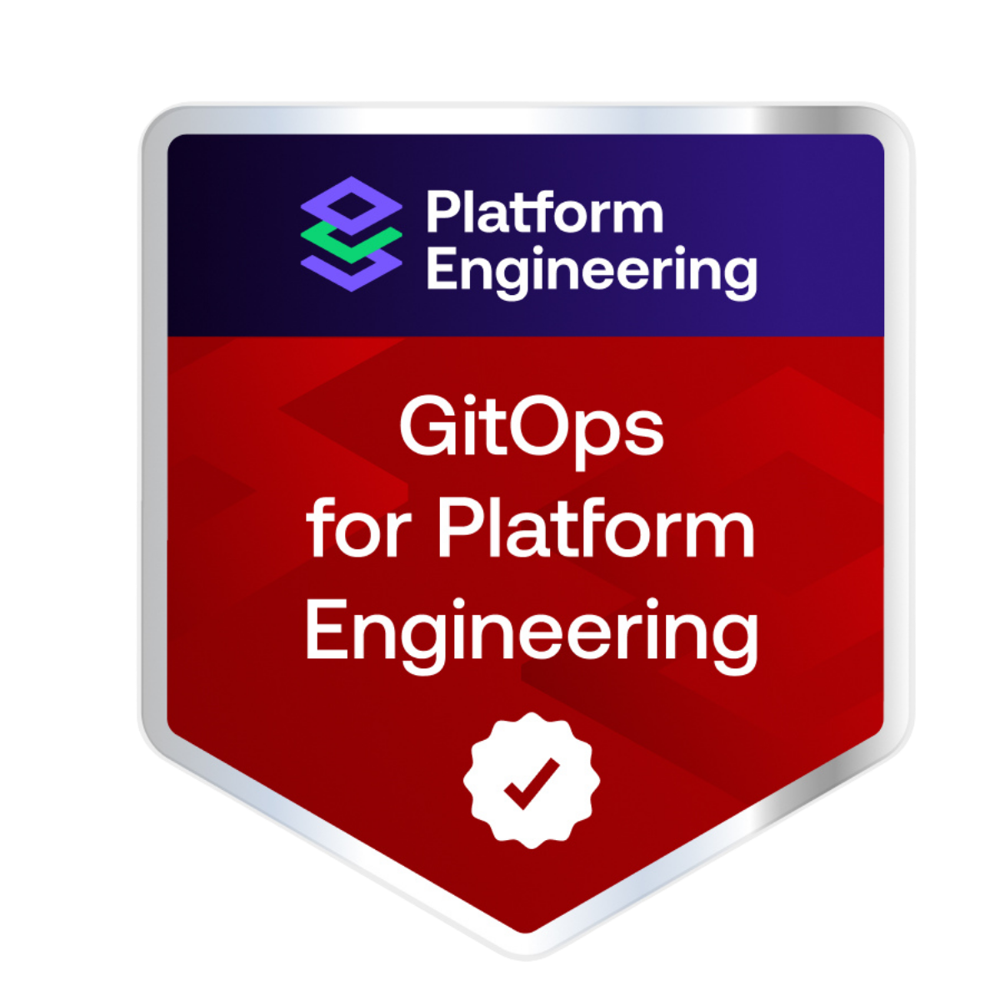

# GitOps Course for Platform Engineering – Hands-On Repository

Welcome to the **hands-on part** of the *GitOps Course for Platform Engineering* and grab your badge by completing this practical setup!

  

This repository is based on the **general distribution** of the **Kubara framework** and represents a **manually recreated, stripped-down variant** of that distro for educational purposes.

👉 **Kubara** is a full-fledged platform engineering framework that provides:

* opinionated defaults
* structured bootstrapping
* lifecycle management
* day-2 operations
* and a consistent platform abstraction layer

In this repository, we **do not use Kubara directly (will be open source soon, probably end of Q1 2026)**.
Instead, we **rebuild the general distro manually** by extracting the generated distro setup to make every step, dependency, and design decision **explicit and understandable**.

This allows you to:

* understand *what Kubara does for you*
* learn *why* certain patterns exist
* and decide later whether you want to adopt Kubara itself

The theoretical background of this course can be found here:

👉 [https://university.platformengineering.org/](https://university.platformengineering.org/)

Check the Prerequisites here:

👉 [Prerequisites](PREREQUISITES.md)

Can't wait to get started? See the Bootstrap instructions here:

👉 [Bootstrap](BOOTSTRAP.md)

Learn more about Kubara here:

👉 [https://kubara.io](https://kubara.io)

---

## What this repository is (and what it is not)

### This repository **is**

* A **hands-on reconstruction** of the Kubara general distro
* A **production-oriented reference setup**
* Opinionated, realistic, and enterprise-style
* Designed to be **adapted**, not blindly copied

### This repository **is not**

* A replacement for Kubara
* A minimal demo
* A beginner Kubernetes tutorial
* A one-size-fits-all solution

---

## Repository usage model

### Forking the repository

If you want to rebuild the setup yourself:

1. **Fork this repository**
2. Replace all references to the original repository URL with your fork and also replace the domain with your own domain in all files.
3. Commit and push the changes to your repository.

If your fork is:

* **Public** → no repository credentials needed
* **Private** → Argo CD must be given repo credentials (SSH or HTTPS)

---

## Important concept: Bootstrap vs. GitOps (Chicken-and-Egg)

  

### Why manual steps are unavoidable

GitOps tools need:

* Git repository access
* Secrets-manager credentials

But those credentials **cannot be fetched via GitOps before GitOps exists**.

This is the **chicken-and-egg problem**.

### How this repository handles it

* **A small number of secrets are created manually**
* **Only during bootstrap**
* **Only once**

After bootstrap:

* All secrets are managed via **External Secrets Operator**.
* No plain secrets are stored in Git! Just put your secrets in the secrets manager.
* The platform becomes fully GitOps-managed

This is **intentional**, **normal**, and **practical** to solve the chicken-and-egg problem.

Let's get started! See the [Prerequisites](PREREQUISITES.md) and the [Bootstrap Guide](BOOTSTRAP.md)! 🔥⛵️