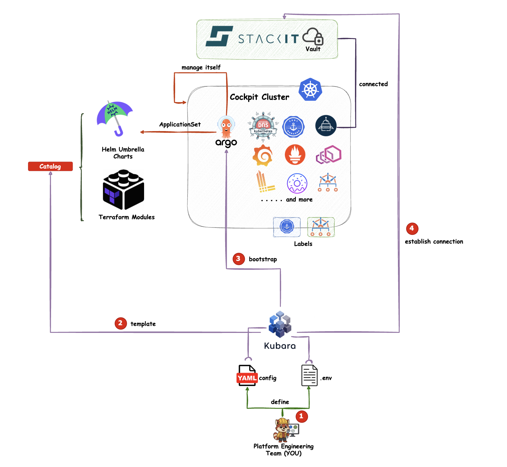
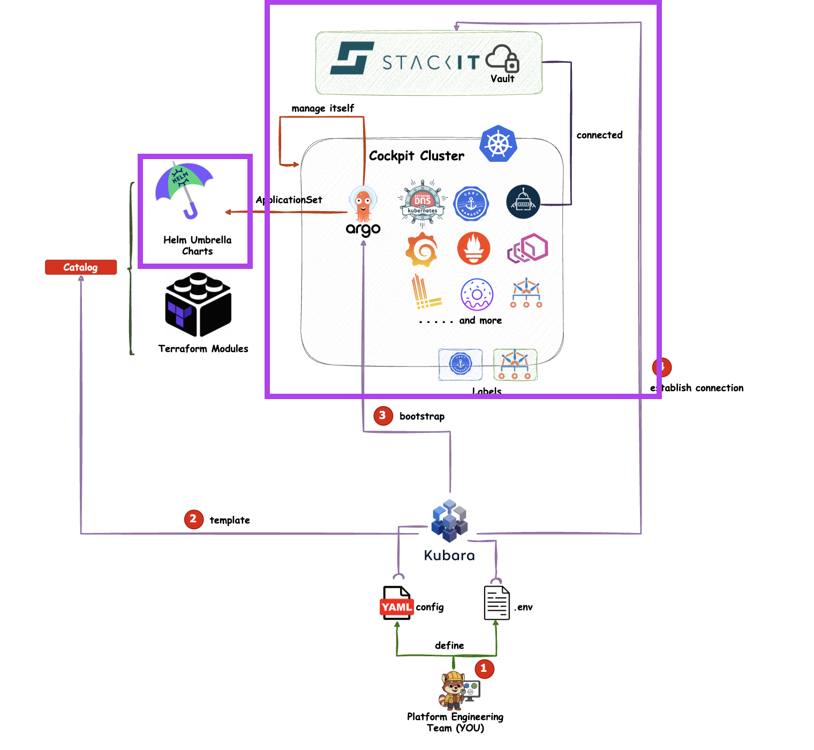
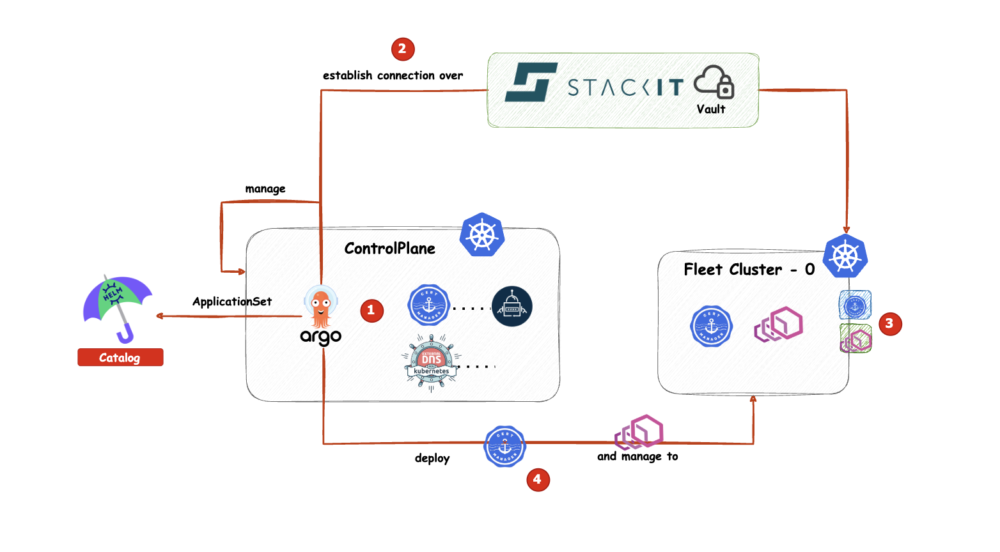

# Introduction: Environment Setup with Kubara

**Note:** I recommend going through this demo **after** completing the course if you want to gain a deeper understanding of the Kubara General Distro and the environment setup used in this course.

[kubara.io](https://kubara.io) is a framework by **STACKIT** that allows you to build **custom platform distributions based on Kubernetes**.
In this setup, you will see a **modified Kubara General Distro** — without the Kubara binary itself, but only the resulting output.

The framework is planned to be **open-sourced by the end of Q1 2026**. More information is available on kubara.io, and you can contact STACKIT to join the early access program.

---

## Idea and Motivation Behind Kubara

The idea behind Kubara is to **bring platform engineers together** and create **platform distributions based on best practices**. These distros are built from real-world experience, including lessons learned from both failures and successes across different companies. 
The general distro for example was build by external services provider, end customers, STACKIT and Schwarz Production,
who are managing large-scale Kubernetes environments in production.

All of this knowledge is packaged into **opinionated platform distros**, like the one shown in this demo. This allows teams to **avoid reinventing the wheel** and instead focus on their **specific use cases**, building on top of a **solid and proven foundation**.

---

## Kubara General Distro Architecture

The Kubara General Distro is based on a **hub-and-spoke topology** using **Argo CD** and includes the following components:





For this course, however, we will focus only on the **relevant parts**:





---

## Service or Addon Catalog based on Helm Umbrella Charts

The catalog is split into two main sections:

### Managed Service Catalog

* Contains **Helm umbrella charts**
* Preconfigured with **best practices and security defaults**
* Extends upstream provider charts with additional resources
  (e.g., a `ClusterIssuer` for cert-manager)

### Customer Service Catalog

* Contains **overlays for each third-party tool**
* Allows **cluster- and use-case-specific configuration**
* Flexible enough to configure every tool individually for each cluster

---

## Deployments with Argo CD ApplicationSets

We use **Argo CD ApplicationSets** together with the **Cluster Generators** to deploy applications or addons across multiple clusters.

An ApplicationSet allows you to define a template that results in **multiple Argo CD Applications**.
Conceptually, it is similar to a **class in Java**, from which multiple instances are created.

### Example: cert-manager ApplicationSet - Cert Manager

```yaml
apiVersion: argoproj.io/v1alpha1
kind: ApplicationSet
metadata:
  name: cert-manager
  namespace: argocd
spec:
  generators:
  - clusters:
      selector:
        matchLabels:
          cert-manager: enabled
  syncPolicy:
    preserveResourcesOnDeletion: false
  template:
    metadata:
      annotations:
        argocd.argoproj.io/manifest-generate-paths: .;..
      name: '{{name}}-cert-manager'
    spec:
      destination:
        name: '{{name}}'
        namespace: cert-manager
      project: pe-gitops-prod
      sources:
      - ref: valuesRepo
        repoURL: git@github.com:InternalDeveloperPlatform/pe-gitops-course.git
        targetRevision: main
      - helm:
          ignoreMissingValueFiles: true
          releaseName: cert-manager
          valueFiles:
          - values.yaml
          - $valuesRepo/customer-service-catalog/helm/{{name}}/cert-manager/values.yaml
        path: managed-service-catalog/helm/cert-manager
        repoURL: git@github.com:InternalDeveloperPlatform/pe-gitops-course.git
        targetRevision: main
      syncPolicy:
        automated:
          allowEmpty: true
          prune: true
          selfHeal: true
        syncOptions:
        - CreateNamespace=false
        - PruneLast=true
        - FailOnSharedResource=true
        - RespectIgnoreDifferences=true
        - ApplyOutOfSyncOnly=true
        - ServerSideApply=true
```

Every cluster connected to the control plane and labeled with
`cert-manager: enabled` automatically receives an **Argo CD Application** that:

* Deploys the **cert-manager Helm chart**
* Uses a **cluster-specific overlay** from the Customer Service Catalog
* Is named `<cluster-name>-cert-manager`
* Is deployed into the `cert-manager` namespace

This approach is also used to manage the **control plane itself**.

---

## Example: Control Plane Application - Cert Manager

Our control plane is named **`pe-gitops`**. The generated Application looks like this:

```yaml
apiVersion: argoproj.io/v1alpha1
kind: Application
metadata:
  annotations:
    argocd.argoproj.io/manifest-generate-paths: .;..
  finalizers:
  - resources-finalizer.argocd.argoproj.io
  name: pe-gitops-cert-manager
  namespace: argocd
  ownerReferences:
  - apiVersion: argoproj.io/v1alpha1
    blockOwnerDeletion: true
    controller: true
    kind: ApplicationSet
    name: cert-manager
spec:
  destination:
    name: pe-gitops
    namespace: cert-manager
  project: pe-gitops-prod
  sources:
  - ref: valuesRepo
    repoURL: git@github.com:InternalDeveloperPlatform/pe-gitops-course.git
    targetRevision: main
  - helm:
      ignoreMissingValueFiles: true
      releaseName: cert-manager
      valueFiles:
      - values.yaml
      - $valuesRepo/customer-service-catalog/helm/pe-gitops/cert-manager/values.yaml
    path: managed-service-catalog/helm/cert-manager
    repoURL: git@github.com:InternalDeveloperPlatform/pe-gitops-course.git
    targetRevision: main
  syncPolicy:
    automated:
      allowEmpty: true
      prune: true
      selfHeal: true
    syncOptions:
    - CreateNamespace=false
    - PruneLast=true
    - FailOnSharedResource=true
    - RespectIgnoreDifferences=true
    - ApplyOutOfSyncOnly=true
    - ServerSideApply=true
```

---

## Connecting Workload Clusters

The Kubara General Distro is used to connect **vClusters, edge clusters, and Civo clusters** as workload clusters to the control plane.

### Adding a vCluster



Example configuration in
`customer-service-catalog/helm/pe-gitops/argo-cd/values.yaml`:

```yaml
- additionalLabels:
    argocd-core: enabled
    cert-manager: enabled
    external-dns: enabled
    external-secrets: enabled
  name: vcluster-project-x
  project: pe-org-prod
  remoteRef:
    remoteKey: my_clusters
    remoteKeyProperty: vcluster-project-x
  secretStoreRef:
    kind: ClusterSecretStore
    name: pe-gitops-prod
```

The cluster kubeconfig is stored in a **managed vault** (e.g., STACKIT Secrets Manager).
The vault is connected to the control plane via the **External Secrets Operator** and a **ClusterSecretStore**.


### ClusterSecretStore Example

```yaml
apiVersion: external-secrets.io/v1
kind: ClusterSecretStore
metadata:
  labels:
    argocd.argoproj.io/instance: pe-gitops-external-secrets
  name: pe-gitops-prod
spec:
  provider:
    vault:
      auth:
        userPass:
          path: userpass
          secretRef:
            key: password
            name: stackit-secrets-manager-cred
            namespace: external-secrets
          username: sm9wir96...
      path: 7877e7a5-af20...
      server: https://prod.sm.eu01.stackit.cloud
      version: v2
```

After that, an entry like the one above must be added to the Git repository.
This is the Kubara General Distro approach, which relies on **extended Helm umbrella charts** with custom logic to create additional resources.

The automatic generation of overlays, Day-2 Operations, etc. is handled by the Kubara framework but is **not part of this course**.

---

## Alternative: Adding Clusters via Argo CD CLI

Clusters can also be added manually using the Argo CD CLI:

```bash
argocd cluster add <context-name> \
  --name <cluster-name> \
  --insecure \
  --label cert-manager=enabled \
  --label external-dns=enabled \
  --label external-secrets=enabled \
  --project pe-org-prod
```

---

## Multi-Tenancy

The Kubara General Distro includes a **built-in multi-tenancy model**.
Each team or project can have its own **Argo CD Project**, defining:

* Allowed source repositories or registries - FROM WHERE?
* Allowed destination clusters - TO WHERE?
* Allowed Kubernetes resources - WHAT or WHICH?
* Additional governance and security rules

The Argo CD Project define the Scope of what each team or project can deploy and manage.

---

## Deploy a Sample Application


```yaml
applications:
  - destination:
      serverName: workload-0
    info:
      - name: type
        value: simple-webapp
    name: simple-webapp
    namespace: argocd
    projectName: simple-webapp
    repoPath: simple-webapp
    repoUrl: https://....
```

This step is **not part of the course**, as the focus is not on deep-diving into Argo CD tooling, but rather on the **core GitOps concepts**.

