## Module 03 – Four Principles of GitOps + Progressive Delivery

You already saw during the course what **internal vs. external reconcilers** mean in the context of GitOps with **Argo CD**, **Flux CD**, or **Sveltos**. In this course we use **Argo CD**, because it is part of the general distro.

Let’s take a look at the **cluster secrets** used by the Argo CD cockpit/control plane.

---

## Internal vs. External Reconciler *(Reminder: who reconciles what, and where)*

We talked about internal and external reconcilers:

* **Internal reconciler** means the system manages **itself** (resources inside its own cluster).
* **External reconciler** means one Argo CD instance manages **external resources on an external cluster**.

### Internal Reconciler secret (decoded) *(Reminder: “in-cluster” target, default Kubernetes API)*


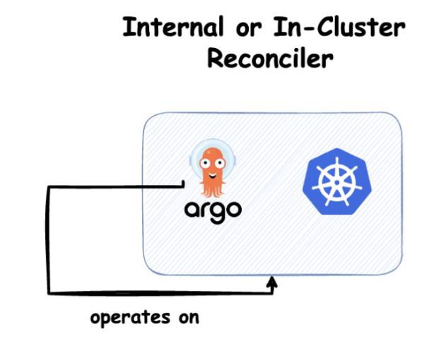

```yaml
config: '{"tlsClientConfig":{"insecure":false}}'
name: pe-gitops
server: https://kubernetes.default.svc
```

And we can see the metadata/labels on the cluster with:

```bash
kubectl describe secret cluster-kubernetes.default.svc -n argocd
```

```yaml
Name:         cluster-kubernetes.default.svc
Namespace:    argocd
Labels:       argo-rollouts=enabled
              argocd=enabled
              argocd.argoproj.io/secret-type=cluster
              cert-manager=enabled
              cilium=disabled
              envoy-gateway=enabled
              external-dns=enabled
              external-secrets=enabled
....
```

### External Reconciler secret *(Reminder: “remote” target, needs kubeconfig/CA/bearer token)*

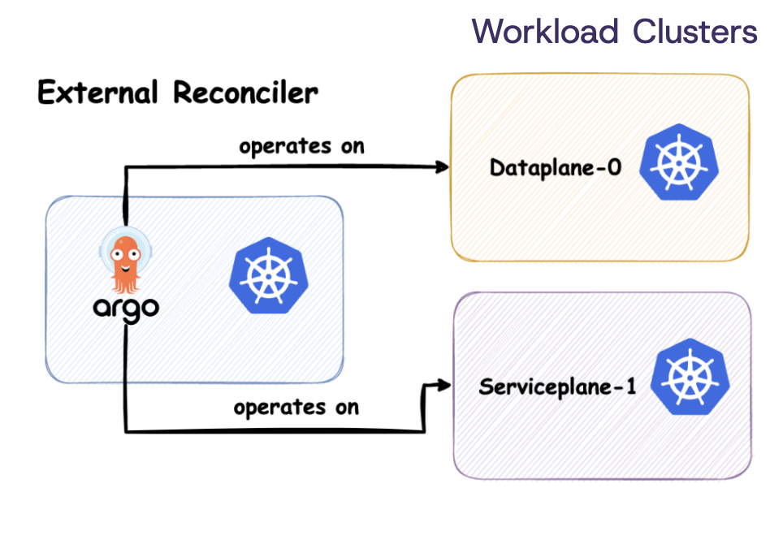


```yaml
config: '{"bearerToken":"","tlsClientConfig":{"caData":"LS0tLS1CRUdJTiBDRVJUSUZJQ0FURS0tLS0tCk1JSUJkek...
project: pe-gitops-prod
server: https://74.220.27.221:6443
```

Or with vCluster:

```yaml
config: '{"bearerToken":"","tlsClientConfig":{"caData":"LS0tLS1CRUdJTiBDRVJUSUZJQ0FURS0tLS0tCk1JSUJke....
name: vcluster-project-x
project: pe-gitops-prod
server: https://vcluster-project-x.pe-gitops-0.stackit.run
```

---

## Declarative *(Reminder: desired state is declared in YAML, not executed as steps)*

Here we have an example from `/examples/module_03/podinfo/deployment.yaml`:

```yaml
apiVersion: apps/v1
kind: Deployment
metadata:
  name: frontend
  namespace: webapp
spec:
  replicas: 3
  minReadySeconds: 3
  revisionHistoryLimit: 5
  progressDeadlineSeconds: 60
  strategy:
    rollingUpdate:
      maxUnavailable: 0
    type: RollingUpdate
  selector:
    matchLabels:
      app: frontend
  template:
    metadata:
      annotations:
        prometheus.io/scrape: "true"
        prometheus.io/port: "9797"
      labels:
        app: frontend
    spec:
      serviceAccountName: webapp
      containers:
      - name: frontend
        image: ghcr.io/stefanprodan/podinfo:6.9.4
        imagePullPolicy: IfNotPresent
...
```

And Argo CD deploys and manages it via the Application:

`/examples/module_03/application.yaml`

```yaml
apiVersion: argoproj.io/v1alpha1
kind: Application
metadata:
  name: module-03
  namespace: argocd
spec:
  destination:
    namespace: webapp
    server: https://kubernetes.default.svc
  project: pe-gitops-prod
  source:
    directory:
      jsonnet: {}
      recurse: true
    path: examples/module_03/podinfo
    repoURL: git@github.com:InternalDeveloperPlatform/pe-gitops-course.git
    targetRevision: HEAD
  syncPolicy:
    automated:
      enabled: true
      prune: true
      selfHeal: true
    syncOptions:
    - CreateNamespace=false
```

As you can see, we are just pointing to `HEAD`.
So if we change `replicas` to 4 and commit the change, Argo CD will fetch `HEAD` (the newest commit), detect drift, and reconcile the cluster back to the desired state.

It is not versioned.

---

## Versioned and Immutable *(Reminder: pin to a tag/commit for reproducibility and rollback)*

If we now change the `targetRevision` to a specific tag like `0.2.0`:

```yaml
apiVersion: argoproj.io/v1alpha1
kind: Application
metadata:
  name: module-03
  namespace: argocd
spec:
  destination:
    namespace: webapp
    server: https://kubernetes.default.svc
  project: pe-gitops-prod
  source:
    directory:
      jsonnet: {}
      recurse: true
    path: examples/module_03/podinfo
    repoURL: git@github.com:InternalDeveloperPlatform/pe-gitops-course.git
    targetRevision: 0.2.0
  syncPolicy:
    automated:
      enabled: true
      prune: true
      selfHeal: true
    syncOptions:
    - CreateNamespace=false
```

This tag points to a version with 3 replicas.

```bash
kubectl apply -f examples/module_03/application-fixed-tag.yaml

kubectl get pods -n webapp

NAME                       READY   STATUS    RESTARTS   AGE
frontend-b5fd785df-9n988   1/1     Running   0          9d
frontend-b5fd785df-crm99   1/1     Running   0          9d
frontend-b5fd785df-jmq9h   1/1     Running   0          9d
```

---

## Continuous Reconciliation *(Reminder: drift correction—Git is the source of truth)*

Just delete the deployment:

```bash
kubectl delete deployment frontend -n webapp

kubectl get pods -n webapp
```

Or even delete the whole namespace with all resources inside:

```bash
kubectl delete ns webapp
kubectl get ns

NAME                      STATUS        AGE
service-cluster           Active        11d
vcluster-project-x        Active        12d
vcluster-project-y        Active        43h
webapp                    Terminating   9d
```

---

## Pull-based *(Reminder: the controller pulls from Git; you don’t push to the cluster)*

This part should be clear, because we are not pushing deployments to the cluster ourselves.
Argo CD pulls and deploys by accessing the Git repository via the repository secret:

```yaml
apiVersion: v1
data:
  enableLfs: dH...
  forceHttpBasicAuth: dH..
  insecure: ZmF...
  name: aHR0cHMt...
  password: Z2l0a...
  project: cGUt..
  url: aHR0cHM6..
  username: bG..
kind: Secret
metadata:
  annotations:
    managed-by: argocd.argoproj.io
  labels:
    argocd.argoproj.io/secret-type: repository
  name: https-init-repo-access
  namespace: argocd
type: Opaque
```

And it points to the repo/path via an Argo CD Application:

```yaml
apiVersion: argoproj.io/v1alpha1
kind: Application
metadata:
  name: module-03
  namespace: argocd
spec:
  destination:
    namespace: webapp
    server: https://kubernetes.default.svc
  project: pe-gitops-prod
  source:
    directory:
      jsonnet: {}
      recurse: true
    path: examples/module_03/podinfo
    repoURL: git@github.com:InternalDeveloperPlatform/pe-gitops-course.git
    targetRevision: 0.2.0
  syncPolicy:
    automated:
      enabled: true
      prune: true
      selfHeal: true
    syncOptions:
    - CreateNamespace=false
```

---

## Progressive Delivery *(Reminder: reduce risk by rolling out changes gradually)*

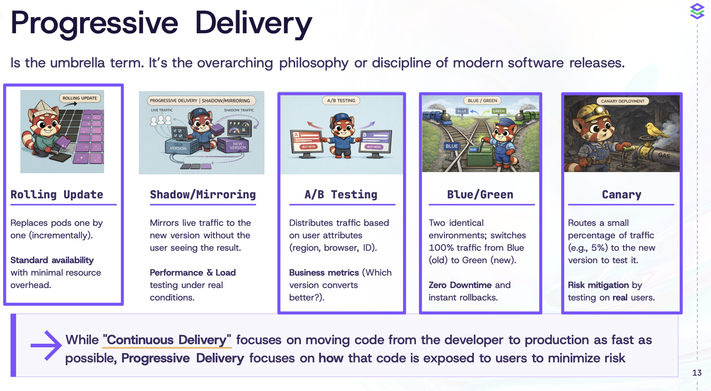


Like promised, in this part we will look at different strategies and how continuous delivery can be achieved through progressive delivery.

### Rolling Updates *(Reminder: Kubernetes default strategy, replaces pods gradually)*

This is the default Deployment strategy in Kubernetes. We just need to replace the version:

```yaml
apiVersion: apps/v1
kind: Deployment
metadata:
  name: frontend
  namespace: webapp
spec:
  replicas: 3
    spec:
      serviceAccountName: webapp
      containers:
      - name: frontend
        image: ghcr.io/stefanprodan/podinfo:6.9.4 <- HERE
        imagePullPolicy: IfNotPresent
...
```

From `6.9.4 -> 6.9.3`

```bash
NAME                        READY   STATUS    RESTARTS   AGE
frontend-5f7467f9bb-sfd8x   1/1     Running   0          18s
frontend-b5fd785df-c9h62    1/1     Running   0          7m15s
frontend-b5fd785df-fccjl    1/1     Running   0          7m15s
frontend-b5fd785df-jqxz2    1/1     Running   0          18s
frontend-b5fd785df-v8tc5    1/1     Running   0          7m15s


NAME                        READY   STATUS    RESTARTS   AGE
frontend-5f7467f9bb-kmbb4   0/1     Running   0          5s
frontend-5f7467f9bb-sfd8x   1/1     Running   0          24s
frontend-b5fd785df-c9h62    1/1     Running   0          7m21s
frontend-b5fd785df-fccjl    1/1     Running   0          7m21s
frontend-b5fd785df-jqxz2    1/1     Running   0          24s

NAME                        READY   STATUS        RESTARTS   AGE
frontend-5f7467f9bb-5h7bm   1/1     Running       0          17s
frontend-5f7467f9bb-f8ck2   0/1     Running       0          2s
frontend-5f7467f9bb-kmbb4   1/1     Running       0          36s
frontend-5f7467f9bb-sfd8x   1/1     Running       0          55s
frontend-b5fd785df-c9h62    1/1     Running       0          7m52s
frontend-b5fd785df-fccjl    1/1     Terminating   0          7m52s

NAME                        READY   STATUS    RESTARTS   AGE
frontend-5f7467f9bb-5h7bm   1/1     Running   0          78s
frontend-5f7467f9bb-f8ck2   1/1     Running   0          63s
frontend-5f7467f9bb-kmbb4   1/1     Running   0          97s
frontend-5f7467f9bb-sfd8x   1/1     Running   0          116s
```

If we take a look at the configuration, it will replace 25% of the pods at a time.
If we have 4 pods, it will replace 1/4. If we have 8 pods, it will replace 2/8 at once. It will only continue if the new pods are healthy and running.

```yaml
strategy:
  rollingUpdate:
    maxSurge: 25%
    maxUnavailable: 0
  type: RollingUpdate
```

---

### Blue-Green with Argo Rollouts *(Reminder: preview first, switch traffic instantly, rollback fast)*

A standard Deployment only supports rolling updates and has no built-in mechanism to test a new version before users see it.

Argo Rollouts adds advanced traffic control, allowing you to route traffic to a **preview** version for testing and perform an instant and safe switch (or rollback) between versions.

You don’t need to install Argo Rollouts if you are using the Kubara setup, because it is already installed as part of the catalog and the cockpit cluster is labeled with `argo-rollouts=enabled`.

Instead of a Deployment, we now use a Rollout and set the strategy to `blueGreen`:

```yaml
apiVersion: argoproj.io/v1alpha1
kind: Rollout
metadata:
  name: frontend
  namespace: webapp-blue-green
spec:
  replicas: 3
  revisionHistoryLimit: 5
  selector:
    matchLabels:
      app: frontend
  strategy:
    blueGreen:
      activeService: frontend
      previewService: frontend-preview
      autoPromotionEnabled: false
  template:
    metadata:
      annotations:
        prometheus.io/scrape: "true"
        prometheus.io/port: "9797"
      labels:
        app: frontend
    spec:
      serviceAccountName: webapp
      containers:
      - name: frontend
        image: ghcr.io/stefanprodan/podinfo:6.9.3
        imagePullPolicy: IfNotPresent
        ports:
...
```

`autoPromotionEnabled: false` tells Argo Rollouts to wait for you. It deploys the new version to the `previewService`, but it won’t switch the `activeService` until you manually promote it via CLI or UI.

For the Rollout to work, you must define the two Services referenced above:

```yaml
apiVersion: v1
kind: Service
metadata:
  name: frontend
  namespace: webapp-blue-green
spec:
  type: ClusterIP
  selector:
    app: frontend
  ports:
    - name: http
      port: 80
      protocol: TCP
      targetPort: http
---
apiVersion: v1
kind: Service
metadata:
  name: frontend-preview
  namespace: webapp-blue-green
spec:
  type: ClusterIP
  selector:
    app: frontend
  ports:
    - name: http
      port: 80
      protocol: TCP
      targetPort: http
```

Now we first deploy all resources imperatively for a better understanding:

```bash
k apply -f examples/module_03/podinfo-blue-green
```

#### 1. Initial State: Stable Version *(Reminder: both services point to stable ReplicaSet)*

Both services point to your current version (e.g., Image 6.9.3 with Color `#34577c`).

* Active Service (`frontend`): handles live traffic from users
* Preview Service (`frontend-preview`): initially points to the same pods

Check status:

```bash
kubectl argo rollouts get rollout frontend -n webapp-blue-green
```

```bash
Name:            frontend
Namespace:       webapp-blue-green
Status:          ✔ Healthy
Strategy:        BlueGreen
Images:          ghcr.io/stefanprodan/podinfo:6.9.3 (stable, active)
Replicas:
  Desired:       3
  Current:       3
  Updated:       3
  Ready:         3
  Available:     3

NAME                                  KIND        STATUS     AGE    INFO
⟳ frontend                            Rollout     ✔ Healthy  2m20s  
└──# revision:1                                                     
   └──⧉ frontend-7d856fb6fc           ReplicaSet  ✔ Healthy  2m20s  stable,active
      ├──□ frontend-7d856fb6fc-t6mtf  Pod         ✔ Running  2m20s  ready:1/1
      ├──□ frontend-7d856fb6fc-lr5xl  Pod         ✔ Running  2m19s  ready:1/1
      └──□ frontend-7d856fb6fc-zdmgc  Pod         ✔ Running  2m19s  ready:1/1
```

Both services point to the same ReplicaSet because we are using Argo Rollouts (not a Deployment/StatefulSet).

#### 2. Triggering the Update *(Reminder: preview gets the new version, active stays stable)*

You update the YAML to image version `6.9.4` and `PODINFO_UI_COLOR` to `"#4cae4f"` (Green).

What happens: Argo Rollouts creates 3 new pods (the “Green” version).

* **Traffic split:** `activeService` still points to the old version, while `previewService` points to the new pods
* **Status:** the rollout is paused because `autoPromotionEnabled: false`

Check status again:

```bash
kubectl argo rollouts get rollout frontend -n webapp-blue-green
```

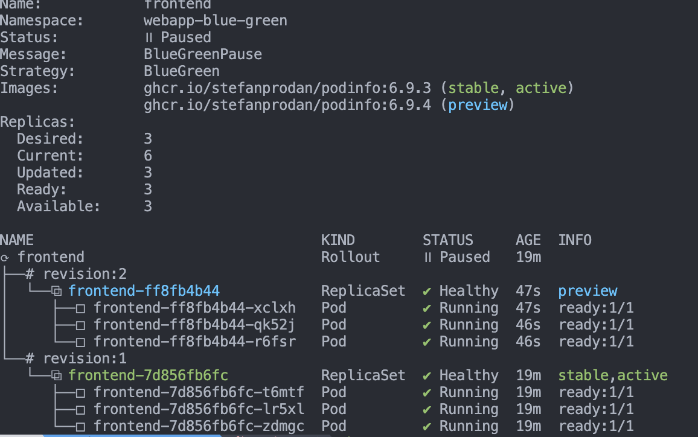

We still have the stable version, but now we have a preview version with 3 new pods.
If we access the preview service, we see version `6.9.4` with the green color. In the CLI output, stable is highlighted differently from preview.

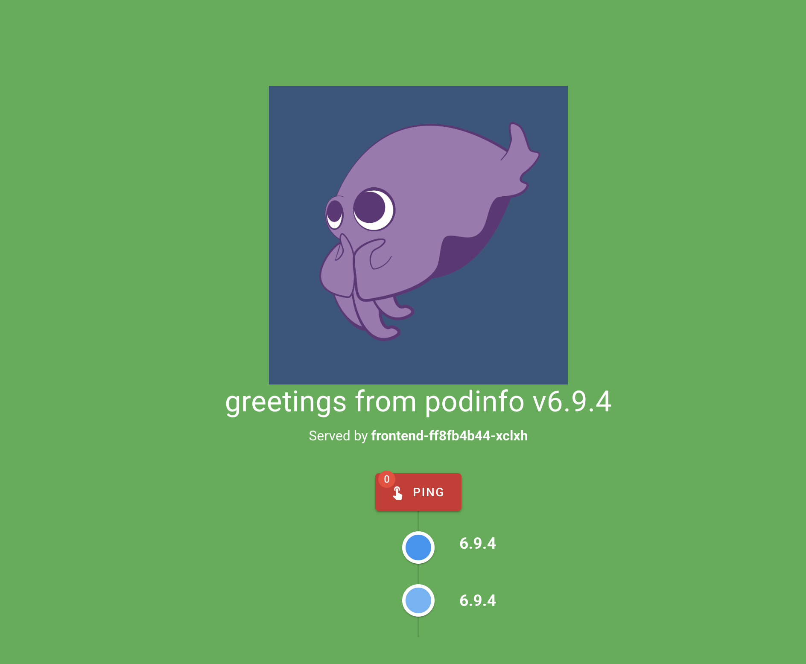


After the check, we promote the new version to active.

#### 3. Promotion *(Reminder: switch all live traffic to the new version instantly)*

Once you are happy with the preview, you move all live users to the new version.

Command:

```bash
kubectl argo rollouts promote frontend -n webapp-blue-green
```

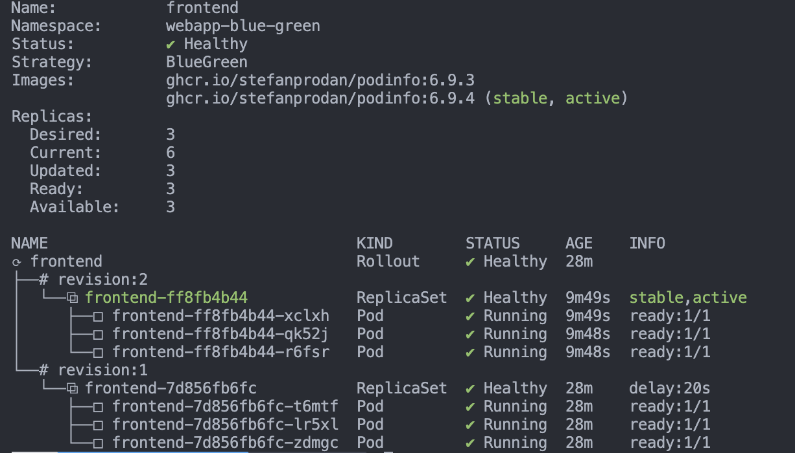

Failsafe: the old pods are still present but receive no traffic.
If something goes wrong, you can rollback quickly.

#### 4. Abort *(Reminder: stop the rollout if preview is bad)*

If the new version crashes or looks wrong in preview, stop it immediately.

Command:

```bash
kubectl argo rollouts abort frontend -n webapp-blue-green
```

Result: the new pods are deleted, and the preview service points back to the stable version.

#### 5. Final State *(Reminder: old version is scaled down after success)*

After a successful promotion and a configurable wait time, the old version is scaled down:

```bash
Name:            frontend
Namespace:       webapp-blue-green
Status:          ✔ Healthy
Strategy:        BlueGreen
Images:          ghcr.io/stefanprodan/podinfo:6.9.4 (stable, active)
Replicas:
  Desired:       3
  Current:       3
  Updated:       3
  Ready:         3
  Available:     3

NAME                                 KIND        STATUS        AGE  INFO
⟳ frontend                           Rollout     ✔ Healthy     32m  
├──# revision:2                                                     
│  └──⧉ frontend-ff8fb4b44           ReplicaSet  ✔ Healthy     13m  stable,active
│     ├──□ frontend-ff8fb4b44-xclxh  Pod         ✔ Running     13m  ready:1/1
│     ├──□ frontend-ff8fb4b44-qk52j  Pod         ✔ Running     13m  ready:1/1
│     └──□ frontend-ff8fb4b44-r6fsr  Pod         ✔ Running     13m  ready:1/1
└──# revision:1                                                     
   └──⧉ frontend-7d856fb6fc          ReplicaSet  • ScaledDown  32m  
```

You can also use the Argo Rollouts UI to manage rollouts visually.
You should not apply manifests manually in production, but instead let Argo CD manage them through GitOps. The manual commands above are only for better understanding.

Short visual recap:

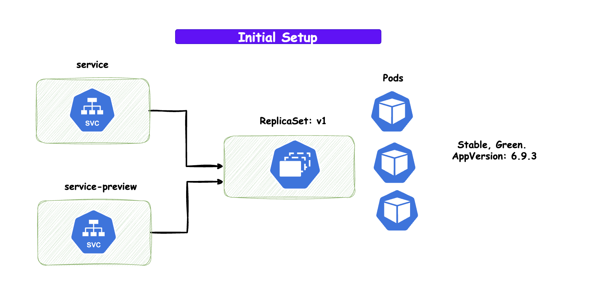

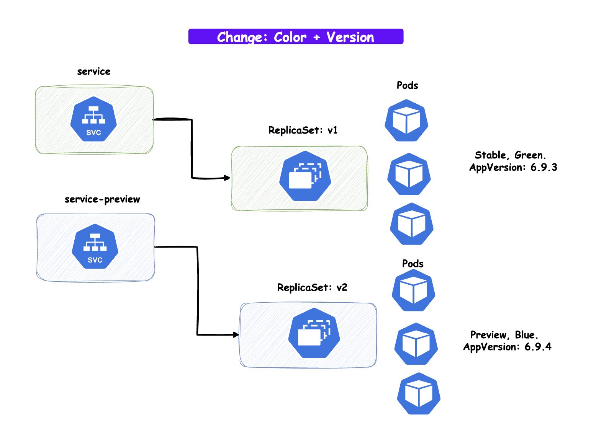


Argo Rollouts supports **Blue-Green** and **Canary** strategies out of the box.

---

### A/B Testing *(Reminder: both versions are live at the same time for comparison)*

Argo Rollouts does not support A/B testing out of the box, but we can achieve it with a bit of manual setup.

You can create two deployments, `frontend-a` and `frontend-b`, with different versions or configurations. Then create one Service that selects pods from both deployments via the same label selector.

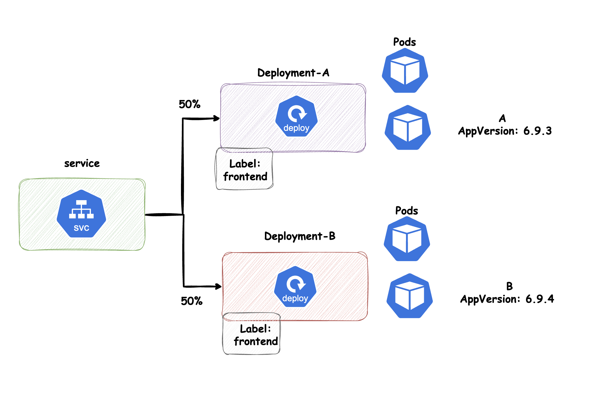

You can find the example under `examples/module_03/podinfo-a-b`, or apply the Argo CD Application to manage it via GitOps:

```bash
kubectl apply -f examples/module_03/application-a-b.yaml
```

If you port-forward the Service and refresh multiple times, sometimes version `6.9.3` (frontend-a) is served and sometimes `6.9.4` (frontend-b) is served. Below is an example output from curl running from another pod in the cluster:

```bash
}{
  "hostname": "frontend-a-5f7467f9bb-8gb6g",
  "version": "6.9.3",
  "revision": "d9fec9778d564fe00d17919121b5822488e0c2d0",
  "color": "#34577c",
  "logo": "https://raw.githubusercontent.com/stefanprodan/podinfo/gh-pages/cuddle_clap.gif",
  "message": "greetings from podinfo v6.9.3",
  "goos": "linux",
  "goarch": "amd64",
  "runtime": "go1.25.4",
  "num_goroutine": "7",
  "num_cpu": "8"
}{
  "hostname": "frontend-b-74599d6c89-5x2fx",
  "version": "6.9.4",
  "revision": "b6b680fe507b8d290de02e6269dec63f5ceac4f5",
  "color": "#4cae4f",
  "logo": "https://raw.githubusercontent.com/stefanprodan/podinfo/gh-pages/cuddle_clap.gif",
  "message": "greetings from podinfo v6.9.4",
  "goos": "linux",
  "goarch": "amd64",
  "runtime": "go1.25.5",
  "num_goroutine": "7",
  "num_cpu": "8"
}{
  "hostname": "frontend-a-5f7467f9bb-mfw94",
  "version": "6.9.3",
  "revision": "d9fec9778d564fe00d17919121b5822488e0c2d0",
  "color": "#34577c",
  "logo": "https://raw.githubusercontent.com/stefanprodan/podinfo/gh-pages/cuddle_clap.gif",
  "message": "greetings from podinfo v6.9.3",
  "goos": "linux",
  "goarch": "amd64",
  "runtime": "go1.25.4",
  "num_goroutine": "7",
  "num_cpu": "8"
}{
  "hostname": "frontend-b-74599d6c89-5x2fx",
  "version": "6.9.4",
  "revision": "b6b680fe507b8d290de02e6269dec63f5ceac4f5",
  "color": "#4cae4f",
  "logo": "https://raw.githubusercontent.com/stefanprodan/podinfo/gh-pages/cuddle_clap.gif",
  "message": "greetings from podinfo v6.9.4",
  "goos": "linux",
  "goarch": "amd64",
  "runtime": "go1.25.5",
  "num_goroutine": "7",
  "num_cpu": "8"
}
```

You can see round-robin load balancing between both deployments. This allows you to compare versions/configurations and measure which performs better or creates more user interaction.

This is different from Blue-Green:

* **Blue-Green:** preview first, then switch all traffic at once
* **A/B testing:** both versions are live simultaneously and share traffic continuously

With Blue-Green you aim for progressive delivery via continuous deployment without downtime. With A/B testing you want to compare two versions/configurations against each other.

---

### Canary *(Reminder: gradually increase exposure to the new version)*

The idea behind canary deployments is to release a new version to a small subset of users before rolling it out to the entire user base. This allows you to monitor the new version for issues in a controlled way. Argo Rollouts makes it easy to implement canary deployments with Kubernetes.

We use Argo Rollouts again, this time with the canary strategy, and apply it with:

```bash
kubectl apply -f examples/module_03/podinfo-canary
```

Here is the Rollout manifest with the canary strategy:

```yaml
apiVersion: argoproj.io/v1alpha1
kind: Rollout
metadata:
  name: frontend
  namespace: webapp-canary
spec:
  replicas: 4 # Total pods. This allows for 25% increments (1 out of 4)
  revisionHistoryLimit: 5
  selector:
    matchLabels:
      app: frontend
  template:
    template:
    metadata:
      annotations:
        prometheus.io/scrape: "true"
        prometheus.io/port: "9797"
      labels:
        app: frontend
    spec:
      serviceAccountName: webapp
      containers:
      - name: frontend
        image: ghcr.io/stefanprodan/podinfo:6.9.4
        imagePullPolicy: IfNotPresent
        ports:
        - name: http
          containerPort: 9898
          protocol: TCP
        - name: http-metrics
          containerPort: 9797
          protocol: TCP
        - name: grpc
          containerPort: 9999
          protocol: TCP
        command:
        - ./podinfo
        - --port=9898
        - --port-metrics=9797
        - --level=info
        - --backend-url=http://backend:9898/echo
        env:
        - name: PODINFO_UI_COLOR
          value: "#4cae4f"
        livenessProbe:
          exec:
            command: ["podcli", "check", "http", "localhost:9898/healthz"]
          initialDelaySeconds: 5
          timeoutSeconds: 5
        readinessProbe:
          exec:
            command: ["podcli", "check", "http", "localhost:9898/readyz"]
          initialDelaySeconds: 5
          timeoutSeconds: 5
        resources:
          limits:
            cpu: 1000m
            memory: 128Mi
          requests:
            cpu: 100m
            memory: 32Mi
  strategy:
    canary:
      # No 'trafficRouting' block means we use basic pod-ratio splitting
      steps:
      - setWeight: 25   # Argo starts 1 new pod (25% of 4)
      - pause: {}       # Pauses indefinitely for manual promotion
      - setWeight: 50   # 2 new pods / 2 old pods
      - pause: { duration: 10m } # Automatic wait
      - setWeight: 100  # Full rollout
```

Initial output example:

```bash
kubectl argo rollouts get rollout frontend -n webapp-canary
```

```bash
Status:          ◌ Progressing
Message:         updated replicas are still becoming available
Strategy:        Canary
  Step:          5/5
  SetWeight:     100
  ActualWeight:  100
Images:          ghcr.io/stefanprodan/podinfo:6.9.3 (stable)
Replicas:
  Desired:       4
  Current:       4
  Updated:       4
  Ready:         0
  Available:     0

NAME                                  KIND        STATUS         AGE  INFO
⟳ frontend                            Rollout     ◌ Progressing  5s   
└──# revision:1                                                       
   └──⧉ frontend-79d98fcfc7           ReplicaSet  ◌ Progressing  5s   stable
      ├──□ frontend-79d98fcfc7-sgnz2  Pod         ✔ Running      4s   ready:0/1
      ├──□ frontend-79d98fcfc7-t58c4  Pod         ✔ Running      4s   ready:0/1
      ├──□ frontend-79d98fcfc7-tsm5c  Pod         ✔ Running      4s   ready:0/1
      └──□ frontend-79d98fcfc7-xszzj  Pod         ✔ Running      4s   ready:0/1
```

Under `strategy` we define the canary steps:

```yaml
strategy:
  canary:
    steps:
    - setWeight: 25
    - pause: {}
    - setWeight: 50
    - pause: { duration: 10m }
    - setWeight: 100
```

After we make a change and apply it, Argo Rollouts starts with step 1:
it sets the weight to 25% (1 out of 4 pods updated), then pauses indefinitely so we can validate the canary.

Example paused state:

```bash
kubectl argo rollouts get rollout frontend -n webapp-canary
```

```bash
Name:            frontend
Namespace:       webapp-canary
Status:          ॥ Paused
Message:         CanaryPauseStep
Strategy:        Canary
  Step:          1/5
  SetWeight:     25
  ActualWeight:  25
Images:          ghcr.io/stefanprodan/podinfo:6.9.3 (stable)
                 ghcr.io/stefanprodan/podinfo:6.9.4 (canary)
Replicas:
  Desired:       4
  Current:       4
  Updated:       1
  Ready:         4
  Available:     4

NAME                                  KIND        STATUS     AGE    INFO
⟳ frontend                            Rollout     ॥ Paused   2m22s  
├──# revision:2                                                     
│  └──⧉ frontend-ff8fb4b44            ReplicaSet  ✔ Healthy  45s    canary
│     └──□ frontend-ff8fb4b44-wfkhg   Pod         ✔ Running  45s    ready:1/1
└──# revision:1                                                     
   └──⧉ frontend-7d6ffb94c5           ReplicaSet  ✔ Healthy  2m22s  stable
      ├──□ frontend-7d6ffb94c5-d2cns  Pod         ✔ Running  2m21s  ready:1/1
      ├──□ frontend-7d6ffb94c5-gj8ph  Pod         ✔ Running  2m21s  ready:1/1
      └──□ frontend-7d6ffb94c5-x7694  Pod         ✔ Running  2m21s  ready:1/1
```

You can see we have 3 stable pods with version 6.9.3 and 1 canary pod with version 6.9.4.

Now we promote it because the rollout is configured for manual promotion:

```bash
kubectl argo rollouts promote frontend -n webapp-canary
```

After that we move to step 2, where 50% runs the new version:

```bash
Name:            frontend
Namespace:       webapp-canary
Status:          ◌ Progressing
Message:         more replicas need to be updated
Strategy:        Canary
  Step:          2/5
  SetWeight:     50
  ActualWeight:  33
Images:          ghcr.io/stefanprodan/podinfo:6.9.3 (stable)
                 ghcr.io/stefanprodan/podinfo:6.9.4 (canary)
Replicas:
  Desired:       4
  Current:       4
  Updated:       2
  Ready:         3
  Available:     3

NAME                                  KIND        STATUS         AGE   INFO
⟳ frontend                            Rollout     ◌ Progressing  3m9s  
├──# revision:2                                                        
│  └──⧉ frontend-ff8fb4b44            ReplicaSet  ◌ Progressing  92s   canary
│     ├──□ frontend-ff8fb4b44-wfkhg   Pod         ✔ Running      92s   ready:1/1
│     └──□ frontend-ff8fb4b44-hkv2d   Pod         ✔ Running      8s    ready:0/1
└──# revision:1                                                        
   └──⧉ frontend-7d6ffb94c5           ReplicaSet  ✔ Healthy      3m9s  stable
      ├──□ frontend-7d6ffb94c5-d2cns  Pod         ✔ Running      3m8s  ready:1/1
      └──□ frontend-7d6ffb94c5-gj8ph  Pod         ✔ Running      3m8s  ready:1/1
```

Now 50% of users are exposed to the new version. After validating 25% and 50%, we can wait until the next step runs automatically after 10 minutes. In the last step, 100% of traffic goes to the new version and all pods are updated.

Final state:

```bash
kubectl argo rollouts get rollout frontend -n webapp-canary
```

```bash
Name:            frontend
Namespace:       webapp-canary
Status:          ✔ Healthy
Strategy:        Canary
  Step:          5/5
  SetWeight:     100
  ActualWeight:  100
Images:          ghcr.io/stefanprodan/podinfo:6.9.4 (stable)
Replicas:
  Desired:       4
  Current:       4
  Updated:       4
  Ready:         4
  Available:     4

NAME                                 KIND        STATUS        AGE    INFO
⟳ frontend                           Rollout     ✔ Healthy     16m    
├──# revision:2                                                       
│  └──⧉ frontend-ff8fb4b44           ReplicaSet  ✔ Healthy     14m    stable
│     ├──□ frontend-ff8fb4b44-wfkhg  Pod         ✔ Running     14m    ready:1/1
│     ├──□ frontend-ff8fb4b44-hkv2d  Pod         ✔ Running     13m    ready:1/1
│     ├──□ frontend-ff8fb4b44-hx5cr  Pod         ✔ Running     2m59s  ready:1/1
│     └──□ frontend-ff8fb4b44-krtpm  Pod         ✔ Running     2m59s  ready:1/1
└──# revision:1                                                       
   └──⧉ frontend-7d6ffb94c5          ReplicaSet  • ScaledDown  16m  
```

In the end we have 4 pods running the new version, and the old version is scaled down to 0.

Short summary of the canary steps:

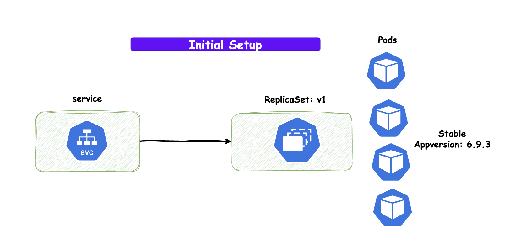

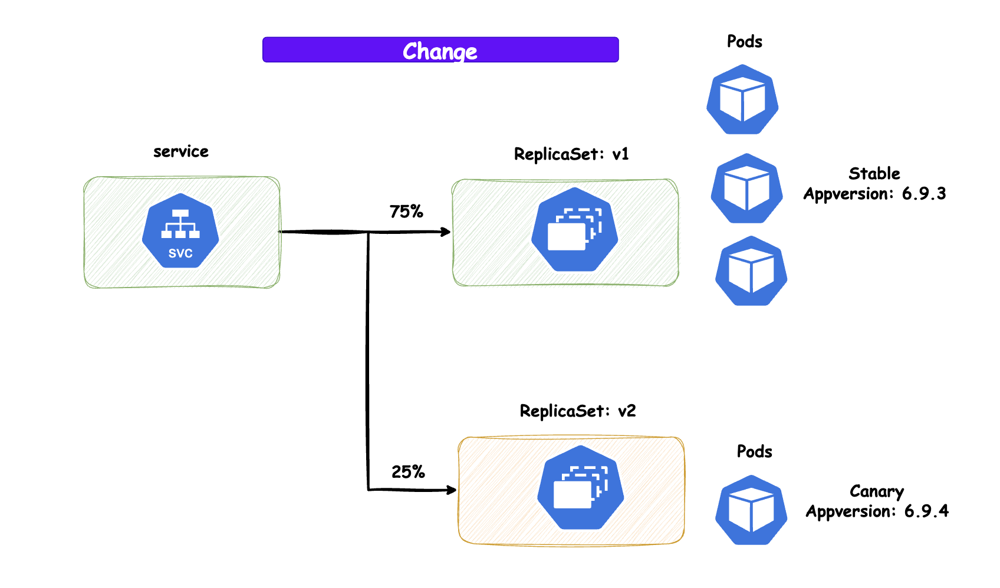

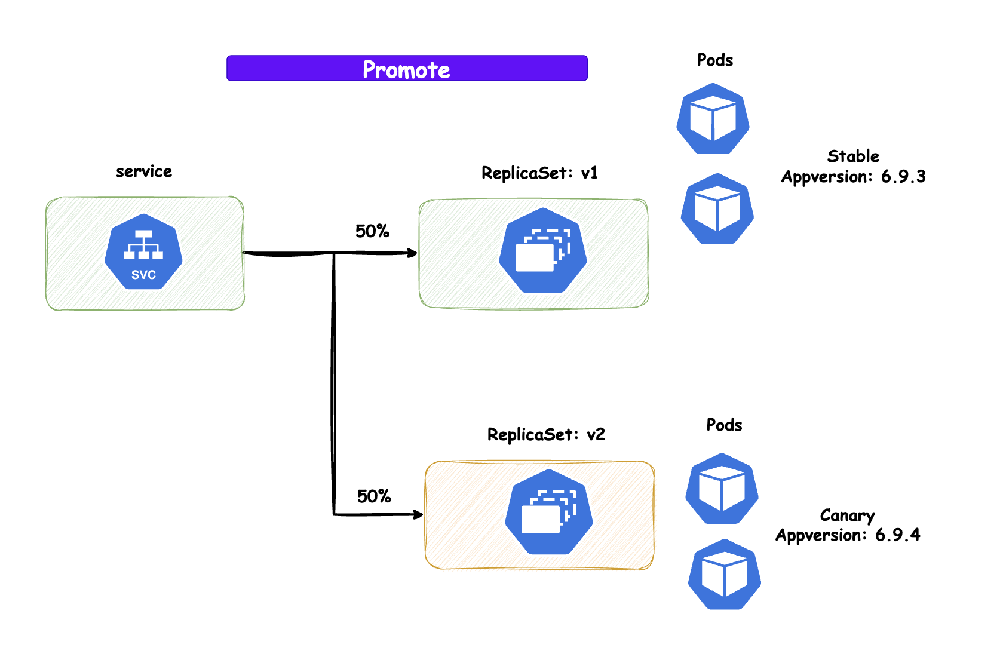

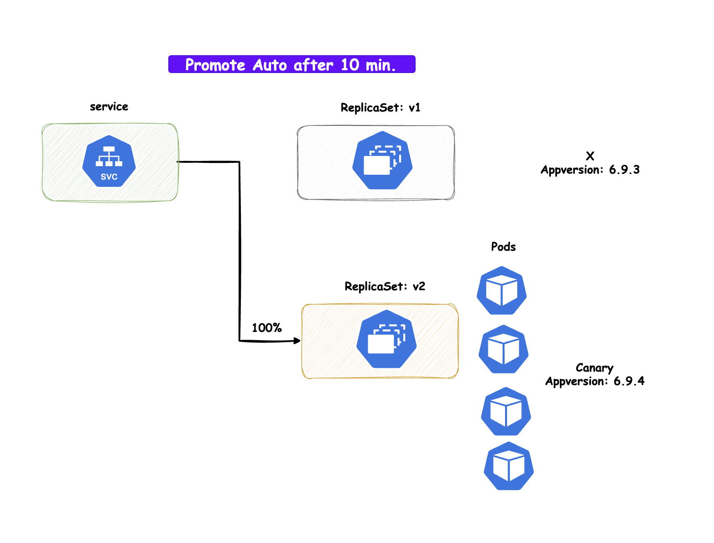


These are multi-step strategies to achieve progressive delivery with Kubernetes and Argo Rollouts.
They enable continuous delivery with minimal risk and downtime by choosing the right strategy for your use case.

---

## Argo Rollouts UI *(Reminder: visual rollout control and debugging)*

You can also inspect rollouts via the Argo Rollouts dashboard:

```bash
kubectl argo rollouts dashboard
```

This opens the browser at `http://localhost:3100`, where you will see:


