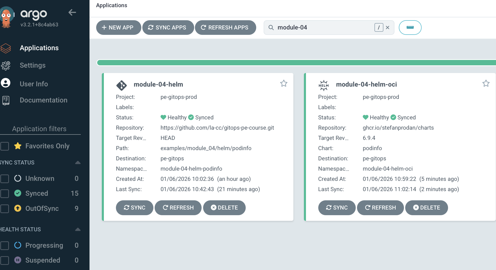
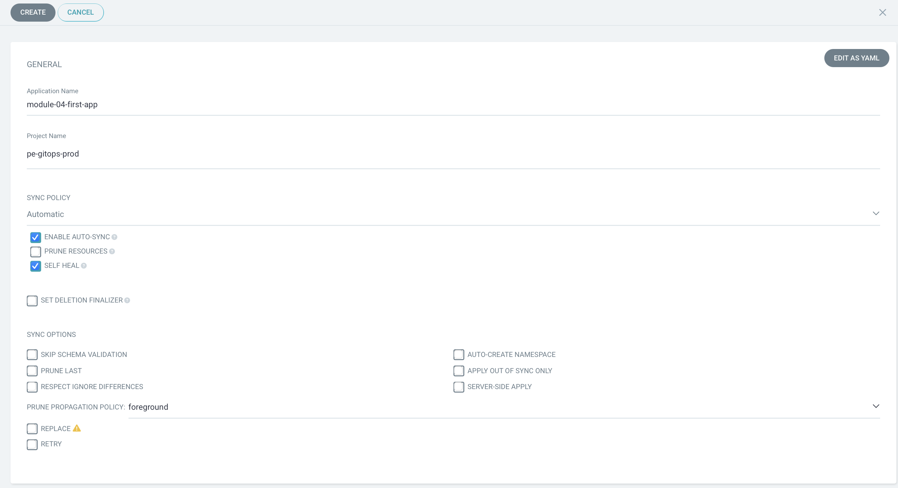
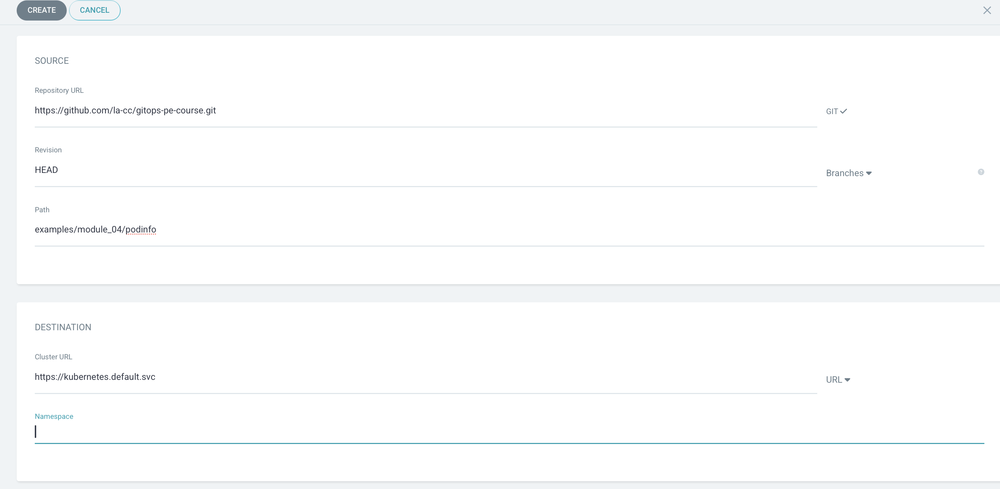
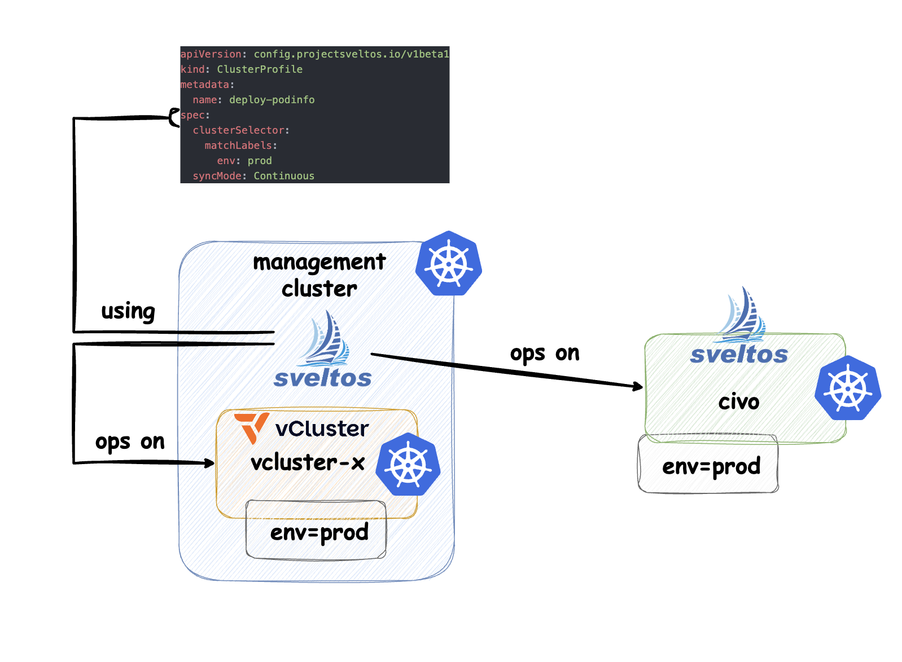

# Module 04 – Tooling 101

## Helm vs. Kustomize

This is **not** a comparison of which tool is better. Instead, this section provides an overview of their **differences, strengths, and typical use cases**.
The goal is to show how **both tools can be used in GitOps workflows**, often even side by side.

---

## Helm

Helm is a **package manager for Kubernetes**. It allows you to define, install, and upgrade complex Kubernetes applications using **Helm charts**.
A Helm chart is a pre-packaged collection of Kubernetes manifests, combined with configuration options, that can be deployed and managed as a single unit.

Under `examples/module_04/helm/podinfo` you can find the same application we used in the previous modules, but now **packaged as a Helm chart**.

You can deploy it using Argo CD via an Application:

```bash
kubectl apply -f examples/module_04/application-helm.yaml
```

Verify that the pods are running:

```bash
kubectl get pods -n module-04-helm-podinfo

NAME                                      READY   STATUS    RESTARTS   AGE
module-04-helm-podinfo-75cc997cf8-6j7t6   1/1     Running   0          4m26s
module-04-helm-podinfo-75cc997cf8-n6jnd   1/1     Running   0          4m26s
```

In this case, the chart is pulled **from Git as a source**.
However, Helm charts can also be consumed **directly from a chart repository**, such as an OCI registry.

To allow this, you must adjust the **allowed source repositories** in:

`customer-service-catalog/helm/pe-gitops/argo-cd/values.yaml`

```yaml
bootstrapValues:
  projects:
    - name: "pe-gitops-prod"
      namespace: argocd
      description: "pe-gitops-prod project"
      sourceRepos:
        - "registry.your.domain"
        - "ghcr.io/stefanprodan/charts/podinfo"
```

Add the repository URL under `sourceRepos`, then redeploy Argo CD with the updated values.

Now you can deploy the application **directly from the Helm repository**:

```bash
kubectl apply -f examples/module_04/application-helm-direct.yaml
```

Check the pods:

```bash
kubectl get pods -n module-04-helm-oci

NAME                                          READY   STATUS    RESTARTS   AGE
module-04-helm-oci-podinfo-76c5ccbcc4-kc28s   1/1     Running   0          50s
module-04-helm-oci-podinfo-76c5ccbcc4-rkwb6   1/1     Running   0          50s
```



---

## Kustomize

Kustomize is a **configuration management tool** that allows you to customize Kubernetes resource definitions **without modifying the original YAML files**.
It uses the concept of **bases and overlays** to apply environment- or context-specific changes.

Remember in **Module 03**, where we discussed the *folder-per-environment* structure?
Here is an example of a Kustomize folder structure used in this module:

```bash
kustomize
└── podinfo
    ├── base
    │   ├── deployment.yaml
    │   ├── kustomization.yaml
    │   └── service.yaml
    └── overlays
        ├── argocd
        │   ├── kustomization.yaml
        │   └── namespace.yaml
        └── fluxcd
            ├── kustomization.yaml
            └── namespace.yaml
```

Instead of environment-based overlays (dev, staging, prod), we use **tools** (Argo CD and Flux CD) as overlays.

We have:

* a **base** with default configuration
* two **overlays**, one for Argo CD and one for Flux CD

```yaml
apiVersion: kustomize.config.k8s.io/v1beta1
kind: Kustomization

resources:
- ../../base
- namespace.yaml

namespace: webapp-argocd

replicas:
- count: 3
  name: podinfo
---
apiVersion: kustomize.config.k8s.io/v1beta1
kind: Kustomization

resources:
- ../../base
- namespace.yaml

namespace: webapp-fluxcd

replicas:
- count: 5
  name: podinfo
```

As you can see, both overlays reference the same base configuration and then apply tool-specific customizations, such as:

* setting a different namespace
* changing the number of replicas

You can deploy the Argo CD overlay using:

```bash
kubectl apply -f examples/module_04/application-kustomize.yaml
```

Verify the pods:

```bash
kubectl get pods -n webapp-argocd
```

Helm and Kustomize are **tool-agnostic**.
They can be used with **Argo CD**, **Flux CD**, or **Sveltos**.

---

## Installation Examples of GitOps Tools with Applications

### Install Argo CD (Helm) + Application (Kustomize)

You can easily install Argo CD using the official Helm chart:

```bash
helm repo add argo https://argoproj.github.io/argo-helm
helm repo update

helm install argocd argo/argo-cd \
  --namespace argocd \
  --create-namespace
```

This creates the `argocd` namespace where all Argo CD components will run.

If you are using the **Kubara General Distro**, use the following approach instead:

```bash
helm template argocd managed-service-catalog/helm/argo-cd/ \
  --namespace argocd \
  --values customer-service-catalog/helm/pe-gitops/argo-cd/values.yaml \
| kubectl apply -f -
```

Once Argo CD is installed, you can access the UI via port-forwarding:

```bash
kubectl port-forward svc/argocd-server -n argocd 8080:443
```

Open your browser at:
[https://localhost:8080/argocd](https://localhost:8080/argocd)


Login with:

* **Username:** `admin`
* **Password:** stored in `argocd-initial-admin-secret`

Get the password with:

```bash
kubectl -n argocd get secret argocd-initial-admin-secret \
  -o jsonpath="{.data.password}" | base64 -d; echo
```

You can now create your first Application via the UI or CLI.

UI examples:





Check the pods:

```bash
kubectl get pods -n webapp-your-first-application-with-argo-cd

NAME                        READY   STATUS    RESTARTS   AGE
frontend-5f7467f9bb-5zqd9   1/1     Running   0          30s
frontend-5f7467f9bb-frg8x   1/1     Running   0          30s
frontend-5f7467f9bb-ws8hj   1/1     Running   0          30s
frontend-5f7467f9bb-zq95q   1/1     Running   0          30s
frontend-5f7467f9bb-zxlt9   1/1     Running   0          30s
```

**Notes:**

* If your repository is private, you must configure repository credentials.
* For production, disable the admin user and configure SSO (e.g. GitHub OAuth2).

🎉 **Congrats! You deployed your first application with Argo CD.**

---

## Install Flux CD (Bootstrapping, Operator) + Application (Kustomize, Helm)

We use the **Flux CLI** to bootstrap Flux CD into the cluster and deploy an application from Git.

In this example, GitHub and a **private repository** are used, so authentication is required.
Here, a **GitHub Personal Access Token (PAT)** is used.

Export your token and bootstrap Flux CD:

```bash
export GITHUB_TOKEN=

flux bootstrap github \
  --token-auth \
  --owner=la-cc \
  --repository=gitops-pe-course \
  --branch=main \
  --path=examples/module_04/flux-bootstrap \
  --personal
```

After bootstrapping, a new folder is created:

```bash
examples/module_04/flux-bootstrap/flux-system
├── gotk-components.yaml
├── gotk-sync.yaml
└── kustomization.yaml
```

Flux CD is now installed and **manages itself using GitOps**.

To deploy an application, create a Kustomization resource:

```bash
kubectl apply -f examples/module_04/flux-kustomization.yaml
```

Flux uses **Kustomization** resources instead of Applications:

```yaml
apiVersion: kustomize.toolkit.fluxcd.io/v1
kind: Kustomization
metadata:
  name: podinfo
  namespace: flux-system
spec:
  interval: 5m
  targetNamespace: webapp-your-first-application-with-fluxcd
  prune: true
  path: examples/module_04/podinfo-flux
  sourceRef:
    kind: GitRepository
    name: flux-system
  wait: true
```

Check the pods:

```bash
kubectl get pods -n webapp-your-first-application-with-fluxcd

NAME                        READY   STATUS    RESTARTS   AGE
frontend-5f7467f9bb-8kw8w   1/1     Running   0          106s
frontend-5f7467f9bb-9mghj   1/1     Running   0          106s
frontend-5f7467f9bb-z429s   1/1     Running   0          106s
```

**Helm releases with Flux CD**
Flux CD supports native Helm deployments. In this mode, applications are installed and managed via Helm charts.
You define a `HelmRepository` to reference the chart source and a `HelmRelease` to declare how the chart should be installed and reconciled, replacing the `GitRepository` and `Kustomization` resources used in Kustomize-based workflows.


```yaml
apiVersion: source.toolkit.fluxcd.io/v1
kind: HelmRepository
metadata:
  name: stefanprodan
  namespace: flux-system
spec:
  interval: 1h
  url: https://stefanprodan.github.io/podinfo
---
apiVersion: helm.toolkit.fluxcd.io/v2
kind: HelmRelease
metadata:
  name: podinfo
  namespace: flux-system
spec:
  interval: 5m
  chart:
    spec:
      chart: podinfo
      version: "6.9.4"
      sourceRef:
        kind: HelmRepository
        name: stefanprodan
        namespace: flux-system
  targetNamespace: webapp-your-first-application-with-fluxcd-helmrelease
  install:
    createNamespace: true
  wait: true
  uninstall:
    keepHistory: false
  values:
    replicaCount: 2
    ui:
      color: "#34577c"
```

Apply the HelmRelease:

```bash
kubectl apply -f examples/module_04/flux-helmrelease.yaml
```

Check the pods:

```bash
kubectl get pods -n webapp-your-first-application-with-fluxcd-helmrelease


```

🎉 **Congrats! You deployed your first application with Flux CD.**

---

## Install Sveltos + Application (Helm) – The Kubara Way

Sveltos can be installed using **manifests, Helm charts, or Kustomize**.
With Helm, it looks like this:

```bash
helm repo add projectsveltos https://projectsveltos.github.io/charts

helm install projectsveltos projectsveltos/projectsveltos \
  -n projectsveltos --create-namespace
```

In Kubara, we wrap the Helm chart in an **umbrella chart**, so deployment is controlled via **labels**.

Enable Sveltos in:

`customer-service-catalog/helm/pe-gitops/argo-cd/values.yaml`

```yaml
inClusterSecretLabels:
##Controlplane labels
  projectsveltos: "enabled"
```

Argo CD now deploys and manages Sveltos itself — a good example of **combining GitOps tools**.

Next, create a `ClusterProfile` to deploy the application:

```yaml
apiVersion: config.projectsveltos.io/v1beta1
kind: ClusterProfile
metadata:
  name: deploy-podinfo
spec:
  clusterSelector:
    matchLabels:
      env: prod
  syncMode: Continuous

  helmCharts:
  - repositoryURL:    oci://ghcr.io/stefanprodan/charts
    repositoryName:   podinfo
    chartName:        podinfo
    chartVersion:     6.9.4
    releaseName:      podinfo
    releaseNamespace: webapp-your-first-application-with-sveltos
    helmChartAction:  Install
    values: |
      replicaCount: 3
      ui:
        color: "#34577c"
      resources:
        requests:
          cpu: 100m
          memory: 64Mi
```

Apply the ClusterProfile (normally via Argo CD or Flux CD, but here directly for simplicity):

```bash
kubectl apply -f examples/module_04/sveltos-clusterprofile.yaml
```

Remember: **Sveltos deploys to managed clusters**, not to the cluster it runs on.
You need a managed cluster labeled `env: prod`.




Example SveltosCluster:

```yaml
apiVersion: lib.projectsveltos.io/v1beta1
kind: SveltosCluster
metadata:
  labels:
    env: prod
    projectsveltos.io/k8s-version: v1.34.1
    sveltos-agent: present
  name: service-cluster-2
  namespace: service-cluster
spec:
  consecutiveFailureThreshold: 3
  kubeconfigKeyName: kubeconfig
  pullMode: false
```

Register the cluster:

```bash
kubectl create ns service-cluster
sveltosctl register cluster \
  --namespace=service-cluster \
  --cluster=service-cluster-2 \
  --labels=env=prod \
  --kubeconfig=vcluster-project-x.yaml
```

Check the pods on the managed cluster:

```bash
kubectl --kubeconfig vcluster-project-x.yaml \
  get pods -n webapp-your-first-application-with-sveltos

NAME                       READY   STATUS    RESTARTS   AGE
podinfo-754444c764-2cn62   1/1     Running   0          85s
podinfo-754444c764-cwj6q   1/1     Running   0          85s
podinfo-754444c764-f9t8k   1/1     Running   0          85s
```

🎉 **Congrats! You have deployed your first application with Sveltos.**

---

## Summary

As you can see, **Helm and Kustomize** are versatile tools that can be integrated into different GitOps workflows, offering flexibility and consistency when managing Kubernetes applications.

What also becomes clear is that **GitOps tools use different approaches** to work with Helm charts and Kustomize manifests.

**Argo CD** renders manifests by executing
`helm template` and `kustomize build` **under the hood**, and then applies the resulting Kubernetes manifests to the cluster.

**Flux CD**, on the other hand, relies on **dedicated controllers**. It manages Helm charts through `HelmRepository` and `HelmRelease` resources and applies Kustomize configurations via `Kustomization` resources, reconciling them continuously against the desired state defined in Git.

**Sveltos** takes a different approach by **installing Helm charts directly** into managed clusters. Using its Helm Addon Controller, Sveltos deploys **real Helm releases** based on `ClusterProfile` definitions and cluster label selectors, enabling a single declarative configuration to be applied consistently across multiple target clusters.

**Sveltos** installs Helm charts as real Helm releases in managed clusters, using label-based selection to apply a single declarative configuration across multiple clusters.

```bash
helm --kubeconfig vcluster-project-x.yaml list  -A

NAME    NAMESPACE                                       REVISION        UPDATED                                 STATUS          CHART           APP VERSION
podinfo webapp-your-first-application-with-sveltos      1               2026-01-06 12:59:06.578081116 +0000 UTC deployed        podinfo-6.9.4   6.9.4
```