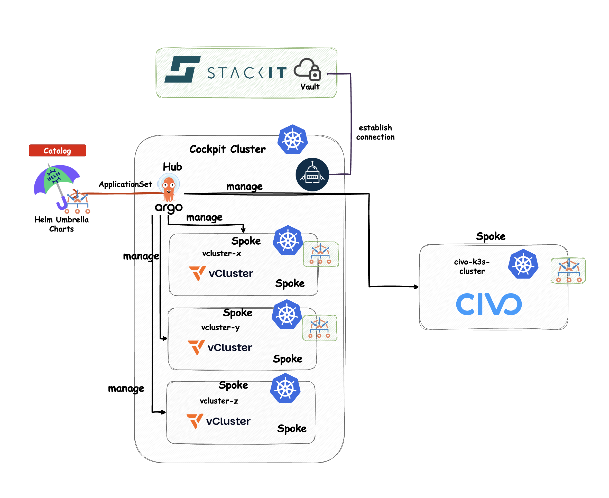
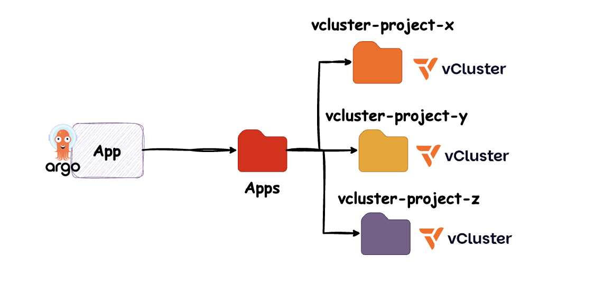
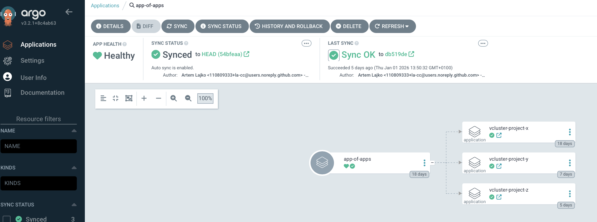
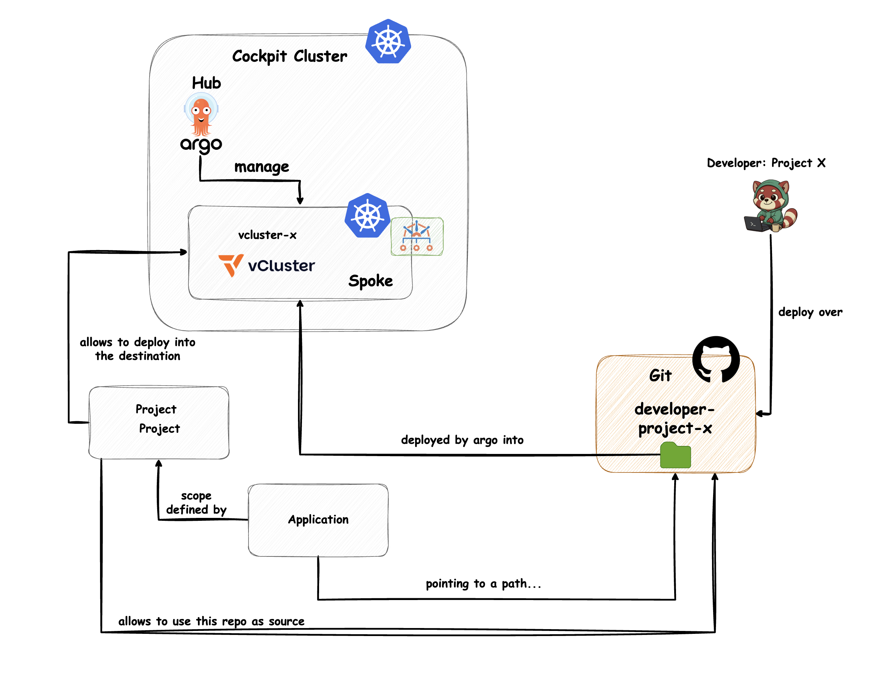

# Module 05 – GitOps in the Enterprise: Scaling and Security (Demo)

## GitOps at Scale – Hub and Spoke

When we talk about **GitOps at scale**, we usually mean managing a **fleet of clusters and applications**.
However, it’s not just about clusters. At enterprise scale, you also need to manage:

* multiple environments
* different teams
* access control and permissions
* organizational policies and compliance requirements

In most cases, this results in building a **platform** that can be safely and efficiently used by many teams.

Managing a fleet of clusters does **not** necessarily mean managing only dedicated physical clusters.
You can also use **virtual clusters** to optimize resource usage while still providing strong isolation.

Scaling GitOps also means having a **central place for configuration**, such as a catalog or hub, where all platform add-ons and third-party tools are defined securely and consistently.

You already learned about different **topologies for GitOps at scale**, their advantages and disadvantages, and how to implement them using tools like **Argo CD**, **Flux CD**, and the **Sveltos Addon Controller**.

For this demo, we use a **Hub-and-Spoke topology with Argo CD**, based on the **Kubara General Distro**.



Let`s take a closer look on vCluster it self.

## vCluster

To reduce costs, optimize resource usage, and enable multi-tenancy, we use **virtual clusters based on vCluster by vCluster Labs**.

**What is vCluster?**
vCluster is a lightweight, virtual Kubernetes cluster that runs inside a namespace of a host cluster, providing strong isolation while sharing the underlying infrastructure.


If you want to go deeper into building a multi-tenancy platform with vCluster and GitOps, check out:
**“How to build a Multi-Tenancy Platform with vCluster and GitOps” – PlatformCon Day Workshop 2025 (YouTube).**


## App of Apps Pattern

To integrate vClusters into our **Hub-and-Spoke topology**, we use the **App of Apps pattern**.

Why this pattern?
ApplicationSets usually require either:

* unique labels on clusters, or
* a predefined list of clusters

Instead, we create **one root Application** that points to a folder.
Every Application manifest placed in this folder is automatically picked up and created as a **separate Argo CD Application**.

This approach is ideal for managing **multiple vClusters** with Argo CD.



```yaml
apiVersion: argoproj.io/v1alpha1
kind: Application
metadata:
  name: app-of-apps
  namespace: argocd
spec:
  destination:
    namespace: argocd
    server: https://kubernetes.default.svc
  project: pe-gitops-prod
  source:
    path: apps
    repoURL: git@github.com:InternalDeveloperPlatform/pe-gitops-course.git
    targetRevision: HEAD
  syncPolicy:
    automated:
      enabled: true
      prune: true
      selfHeal: true
    syncOptions:
    - RespectIgnoreDifferences=true
```

Apply it:

```bash
kubectl apply -f examples/module_05/app-of-app-application.yaml
```



This is how our setup for this demo looks like and this can easiy scale to a large number of clusters and applications.
But to keep things secure, we also need to implement multi-tenancy and compliance.
Let’s see how we can achieve this with tools like Argo CD.

---

## Multi-Tenancy

We also establish **multi-tenancy across repositories, applications, and clusters** using **Argo CD Projects (AppProject)**.

Multi-tenancy is enforced across:

* repositories
* applications
* clusters

All of this is defined within the **project scope**.



This how the resources behind it looks like if you want to create them manually.

### AppProject

```yaml
apiVersion: argoproj.io/v1alpha1
kind: AppProject
metadata:
  annotations:
    argocd.argoproj.io/tracking-id: pe-gitops-argocd:argoproj.io/AppProject:argocd/developer-repo-project-x
  name: developer-repo-project-x
  namespace: argocd
spec:
  clusterResourceWhitelist:
  - group: '*'
    kind: '*'
  description: developer-repo-project-x project
  destinations:
  - namespace: '*'
    server: 'vcluster-project-x'
  orphanedResources:
    ignore:
    - kind: Secret
      name: cert-manager-webhook-ca
    warn: false
  permitOnlyProjectScopedClusters: false
  sourceNamespaces:
  - '*'
  sourceRepos:
  - registry.onstackit.cloud/stackit-edge-cloud-blueprint
  - git@github.com:InternalDeveloperPlatform/pe-gitops-course.git
```


### Application

```yaml
apiVersion: argoproj.io/v1alpha1
kind: Application
metadata:
  annotations:
    argocd.argoproj.io/tracking-id: pe-gitops-argocd:argoproj.io/Application:argocd/developer-repo-project-x-developer-repo-project-x
  name: developer-repo-project-x-developer-repo-project-x
  namespace: argocd
spec:
  destination:
    name: vcluster-project-x
    namespace: argocd
  info:
  - name: type
    value: developer-repo-project-x
  project: developer-repo-project-x
  revisionHistoryLimit: 10
  source:
    path: examples/module_05/developer-repo-project-x/podinfo
    repoURL: git@github.com:InternalDeveloperPlatform/pe-gitops-course.git
    targetRevision: main
  syncPolicy:
    automated:
      allowEmpty: true
      prune: true
      selfHeal: true
    syncOptions:
    - CreateNamespace=false
    - PruneLast=true
    - FailOnSharedResource=true
    - RespectIgnoreDifferences=true
    - ApplyOutOfSyncOnly=true
```


### Repository (Secret) - if not public

```yaml
apiVersion: v1
data:
  insecure: ZmF...
  name: ZGV2...
  password: Z2l...
  project: ZGV2...
  type: Z2...
  url: aHR0cHM...
  username: b...
kind: Secret
metadata:
  labels:
    argocd.argoproj.io/secret-type: repository
    reconcile.external-secrets.io/managed: "true"
  name: developer-repo-project-x-repo
  namespace: argocd
  ownerReferences:
  - apiVersion: external-secrets.io/v1
    blockOwnerDeletion: true
    controller: true
    kind: ExternalSecret
    name: developer-repo-project-x-es
type: Opaque
```


### Cluster (Secret)

```yaml
apiVersion: v1
data:
  config: eyJiZWFyZXJUb2tlbiI...
  name: dmNsdX...
  project: cGUtZ2l0b...
  server: aHR0cHM6Ly92Y2x...
kind: Secret
metadata:
  labels:
    kyverno: enabled
    kyverno-policies: enabled
  name: vcluster-project-x-cluster-secret
  namespace: argocd
  ownerReferences:
  - apiVersion: external-secrets.io/v1
    blockOwnerDeletion: true
    controller: true
    kind: ExternalSecret
    name: vcluster-project-x
```

Alternatively, all of this can be defined centrally in:

`customer-service-catalog/helm/pe-gitops/argo-cd/values.yaml` under projects, repositories, and clusters

when using the **Kubara General Distro**. This how I did it for this demo.

```yaml
projects:
    - name: "pe-gitops-prod"
      namespace: argocd
      description: "pe-gitops-prod project"
      sourceRepos:
        - "registry.your.domain"
        - " ghcr.io/stefanprodan/charts"
      orphanedResources:
      destinations:
        - namespace: '*'
          server: 'vcluster-project-x'
        warn: false
        ignore:
          - kind: Secret
            name: cert-manager-webhook-ca
    - description: "developer-repo-project-x project"

applications:
    - destination:
        serverName: vcluster-project-x
      info:
        - name: type
          value: developer-repo-project-x
      name: developer-repo-project-x
      namespace: argocd
      projectName: developer-repo-project-x
      repoPath: examples/module_05/developer-repo-project-x/podinfo
      repoUrl: git@github.com:InternalDeveloperPlatform/pe-gitops-course.git

## Need to push the cluster config secret to the vault.
repositories:
    - name: developer-repo-project-x
      projectScope: developer-repo-project-x
      remoteRef:
        remoteKey: repos
        remoteKeyProperty: vcluster-project-x-developer-repo
      repoType: git
      secretStoreRef:
        kind: ClusterSecretStore
        name: pe-gitops-prod
      url: git@github.com:InternalDeveloperPlatform/pe-gitops-course.git
      username: la-cc
```

Let’s verify that the business application is deployed in the vCluster:

```bash
kubectl get ns --kubeconfig vcluster-project-x.yaml

kubectl get pods -n webapp --kubeconfig vcluster-project-x.yaml
```

```bash
NAME                        READY   STATUS    RESTARTS   AGE
frontend-5f7467f9bb-5mb69   1/1     Running   0          7m4s
frontend-5f7467f9bb-5qss6   1/1     Running   0          7m4s
frontend-5f7467f9bb-7hkvb   1/1     Running   0          7m4s
frontend-5f7467f9bb-cjxbs   1/1     Running   0          7m4s
frontend-5f7467f9bb-gp7fq   1/1     Running   0          7m4s
```


---

## Compliance and Governance

At enterprise scale, every new workload cluster must comply with:

* organizational policies
* security standards
* industry best practices

Below is an example using **Kyverno** and policy enforcement to keep clusters compliant at scale.
In real-world setups, this is usually complemented by additional layers, such as:

* kernel-level security (e.g. Falco)
* runtime security (e.g. Aqua Security, Sysdig)
* observability and monitoring solutions

All of this is required if you want to provide a **secure, self-service platform** for multiple teams.

```bash
kubectl get clusterpolicies -A --kubeconfig vcluster-project-x.yaml

NAME                                           ADMISSION   BACKGROUND   READY   AGE     MESSAGE
application-prevent-default-project            true        true         True    7m13s   Ready
application-prevent-updates-project            true        true         True    7m13s   Ready
cert-manager-limit-dnsnames                    true        true         True    7m13s   Ready
cert-manager-limit-duration                    true        true         True    7m13s   Ready
cert-manager-restrict-issuer                   true        true         True    7m13s   Ready
disallow-capabilities                          true        true         True    7m13s   Ready
disallow-default-namespace                     true        true         True    7m12s   Ready
disallow-host-namespaces                       true        true         True    7m12s   Ready
disallow-host-path                             true        true         True    7m12s   Ready
disallow-host-ports                            true        true         True    7m12s   Ready
disallow-host-process                          true        true         True    7m12s   Ready
disallow-ingress-nginx-custom-snippets         true        true         True    7m12s   Ready
```

```bash
kubectl get policyreports -A --kubeconfig vcluster-project-x.yaml

NAMESPACE                                    NAME                                   KIND         NAME                                                   PASS   FAIL   WARN   ERROR   SKIP   AGE
projectsveltos                               040bbd51-4ad6-4706-9f43-3d5d99452021   ConfigMap    sveltos-agent-version                                  1      0      0      0       0      7m23s
projectsveltos                               508302e1-da88-4f82-afdf-5e6b847e6ad4   Pod          sveltos-agent-manager-584f9cfd85-h5rhz                 19     1      0      0       0      7m26s
projectsveltos                               78fafbbe-4309-488d-9ce7-b6af0edc7e2b   Deployment   drift-detection-manager                                1      0      0      0       1      7m29s
projectsveltos                               940836f1-a6fd-4898-b9fd-3ae5a63fd36e   Deployment   sveltos-agent-manager                                  1      0      0      0       1      7m28s
projectsveltos                               c3f6e074-1c05-40b9-b847-bacb1983cc0d   Pod          drift-detection-manager-6846f8c8d9-rw5w4               19     1      0      0       0      7m27s
projectsveltos                               e56a6547-02ea-4528-916c-1f5bee065550   ConfigMap    kube-root-ca.crt                                       1      0      0      0       0      7m23s
webapp                                       0b6ff31b-e3ac-4a54-b594-9d3a5adf3298   Pod          frontend-5f7467f9bb-7hkvb                              18     2      0      0       0      7m28s
webapp                                       31ebff80-09de-4282-b4a3-0cede9c9f2e3   Pod          frontend-5f7467f9bb-cjxbs                              18     2      0      0       0      7m26s
webapp                                       5cd2c98d-728e-4094-8d37-ea7c07835428   Pod          frontend-5f7467f9bb-5mb69                              18     2      0      0       0      7m27s
webapp                                       6bf2befc-413c-4c61-997f-8264ec672d1d   Pod          frontend-5f7467f9bb-5qss6                              18     2      0      0       0      7m25s
webapp                                       7215381a-5ab9-48b1-ac35-77ada467e586   ConfigMap    kube-root-ca.crt                                       1      0      0      0       0      7m23s
webapp                                       79914e86-d58d-432f-95f8-8455a099ba94   Deployment   frontend                                               1      1      0      0       0      7m28s
webapp                                       7c68e8c8-8fb7-49d0-bf2e-84fb64a1d98d   Pod          frontend-5f7467f9bb-gp7fq                              18     2      0      0       0      7m27s
```

```bash
kubectl get policyreport -n webapp 0b6ff31b-e3ac-4a54-b594-9d3a5adf3298 \
  --kubeconfig vcluster-project-x.yaml \
  -o json | jq '.results[] | select(.result=="fail")'

{
  "category": "IT-Grundschutz (standard)",
  "message": "validation error: Privilege escalation is disallowed. The fields spec.containers[*].securityContext.allowPrivilegeEscalation, spec.initContainers[*].securityContext.allowPrivilegeEscalation, and spec.ephemeralContainers[*].securityContext.allowPrivilegeEscalation must be set to `false`. rule privilege-escalation failed at path /spec/containers/0/securityContext/",
  "policy": "disallow-privilege-escalation-itgrundschutz",
  "properties": {
    "process": "background scan"
  },
  "result": "fail",
  "rule": "privilege-escalation",
  "scored": true,
  "severity": "medium",
  "source": "kyverno",
  "timestamp": {
    "nanos": 0,
    "seconds": 1767767526
  }
...
```

And you will also need a way to manage secrets in a secure and scalable way.
For that, you can use tools like **External Secrets Operator** to fetch secrets from a centralized vault for the common operations.
But in the kubara general distro a managed vault per workload cluster will be created automatically for the teams to isolate their secrets from each other and from the platform itself.

Just to show a few examples of secrets synced via External Secrets Operator in the cockpit, hub or control plane cluster:

```bash
kubectl get externalsecrets -A

NAMESPACE               NAME                           STORETYPE            STORE            REFRESH INTERVAL   STATUS         READY
argocd                  civo-k3s-es                    ClusterSecretStore   pe-gitops-prod   5m                 SecretSynced   True
argocd                  developer-repo-project-x-es    ClusterSecretStore   pe-gitops-prod   5m                 SecretSynced   True
argocd                  oauth2-credentials-es          ClusterSecretStore   pe-gitops-prod   5m                 SecretSynced   True
argocd                  vcluster-project-x-es          ClusterSecretStore   pe-gitops-prod   5m                 SecretSynced   True
argocd                  vcluster-project-y-es          ClusterSecretStore   pe-gitops-prod   5m                 SecretSynced   True
argocd                  vcluster-project-z-es          ClusterSecretStore   pe-gitops-prod   5m                 SecretSynced   True
external-dns            external-dns-webhook-es        ClusterSecretStore   pe-gitops-prod   5m                 SecretSynced   True
kube-prometheus-stack   grafana-admin-credentials-es   ClusterSecretStore   pe-gitops-prod   5m                 SecretSynced   True
kube-prometheus-stack   oauth2-credentials-es          ClusterSecretStore   pe-gitops-prod   5m                 SecretSynced   True
```

So let's take a look at the GUI of Argo CD to see how everything looks like there.